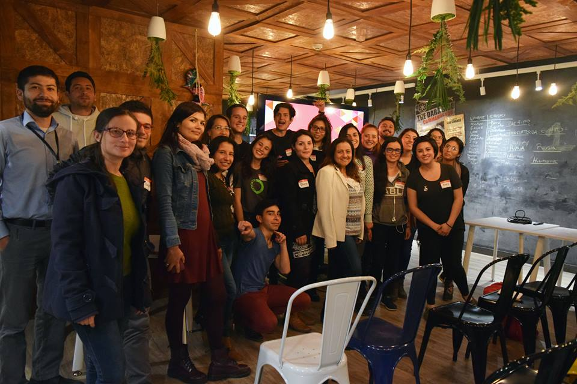

# Bienvenido a PyLadies Colombia

Pyladies Colombia, es una comunidad con objetivo de enseñar y fomentar la presencia de mujeres en la industria tecnología. La diversidad es clave y es por tal razón que buscamos convertir a todos nuestros participantes en personajes activos y líderes en la comunidad de Python en Colombia y el mundo. Esta comunidad está abierta tanto a mujeres como a todo aquel que quiera aprender y conocer gente (todo alrededor de Python). Todos son bienvenidos independientemente de su identidad, su expresión de género, su orientación sexual, su discapacidad, su apariencia física, su estado socioeconómico, el tamaño de su cuerpo, su etnia, su nacionalidad, su nivel de experiencia, su edad o su religión (o la falta de ella).

Para contactarte con nosotros, por favor escríbenos un correo a pyladiesco@gmail.com

## Siguenos en nuestras redes sociales

Facebook:

- [PyLadies Colombia](https://www.facebook.com/pyladiesco/)
- [PyLadies Medellin](https://www.facebook.com/pyladiesmedellin/)

Twitter:

- [PyLadies Colombia](https://twitter.com/pyladies_co)
- [PyLadies Medellin](https://twitter.com/pyladiesmed)

Instagram:

- [PyLadies Colombia](https://www.instagram.com/pyladies_co)
- [PyLadies Medellin](https://www.instagram.com/pyladiesMed/)

## Aportar a este Website

Clona el repositorio y sigue los pasos guia del tema Jekyll [Type on Strap](https://github.com/sylhare/Type-on-Strap) Envia un ``pull request` y listo.

## Codigo de Conducta

Usamos como código de conducta el código de Pyladies internacional: http://www.pyladies.com/CodeOfConduct/ donde buscamos dar tranquilidad y seguridad a todas las personas que nos visiten y darles por hecho que pueden contar con nosotros en cualquier caso que no cumpla o irrespete este código. Está comunidad se extiende por medio de estos meetups, conferencias futuras, eventos sociales y proyectos interdisciplinarios que construiremos con todos ustedes. Para contactarte con nosotros, por favor escríbenos un correo a pyladiesco@gmail.com 